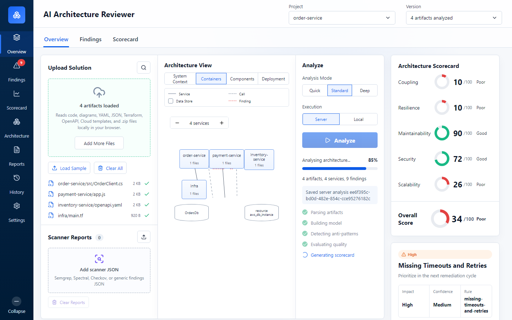
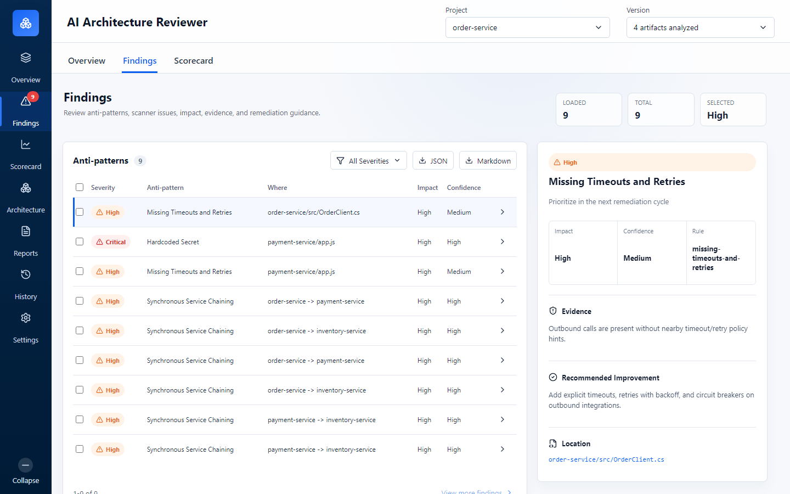
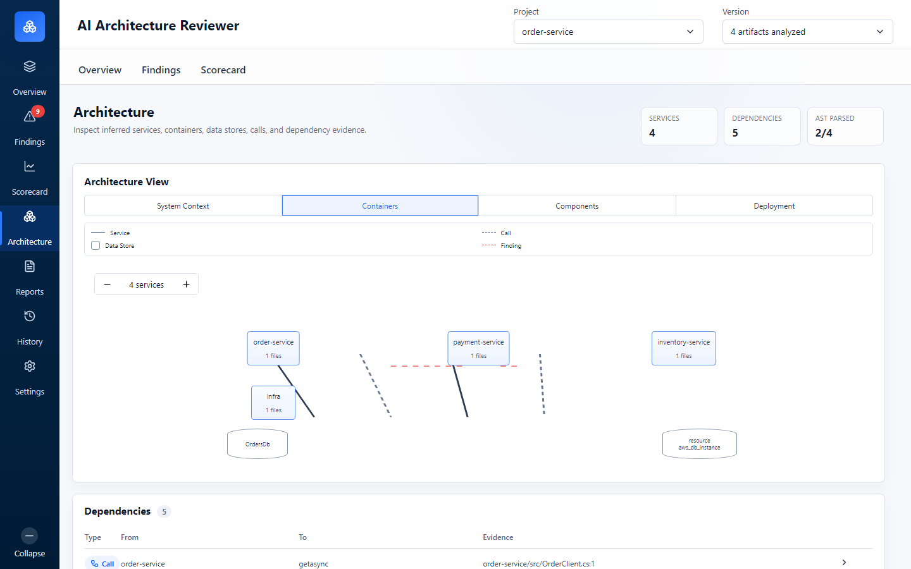
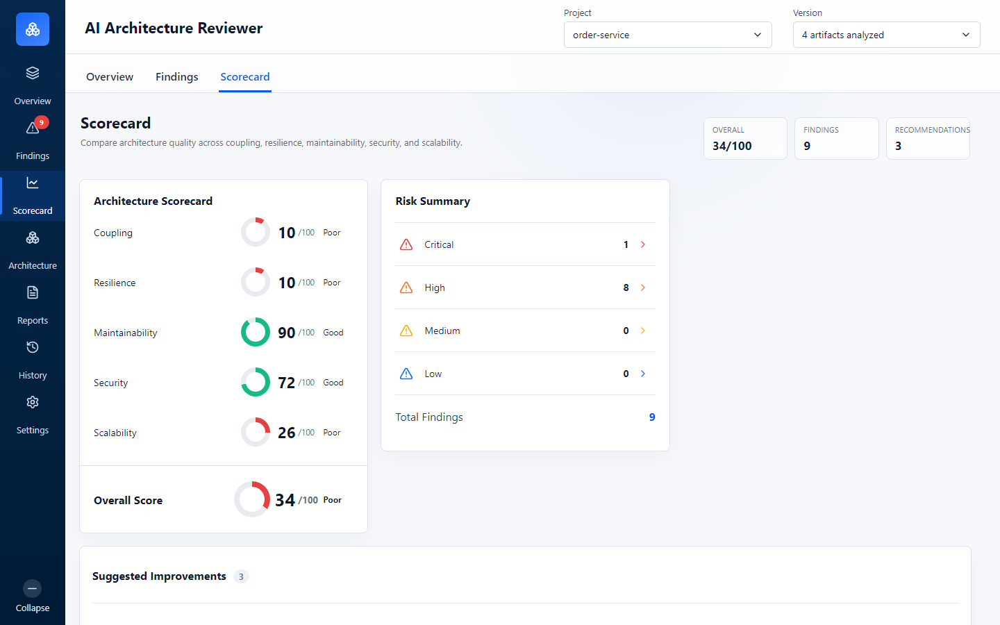

# AI Architecture Reviewer

**AI Architecture Reviewer** is an open-source, local-first architecture review platform for engineering leaders, solution architects, and engineering managers. Upload a source-code repository or `.zip` solution package, analyze architecture structure, detect anti-patterns, inspect dependencies, and generate an architecture scorecard with actionable improvement recommendations.

This project is built as a real product, not a mockup: it includes a React web app, Express API, worker-thread analysis jobs, reusable analyzer package, CLI, Electron desktop shell, tests, documentation, and GitHub-ready project structure.

## Why This Project Stands Out

- **Architecture intelligence for real repositories**: analyzes source files, config, infrastructure files, APIs, SQL, stored procedures, and zipped codebases.
- **Local-first by design**: run analysis in the browser, through a local API, from the CLI, or inside the Electron desktop shell.
- **Large repository support**: server mode uses background jobs, progress polling, persisted results, and paginated findings/dependency endpoints.
- **Recruiter/interviewer friendly architecture**: monorepo, reusable core package, worker threads, API boundaries, desktop packaging, test coverage, and modular UI.
- **No vendor lock-in**: deterministic analysis works without an AI provider; future AI integrations can be optional and provider-configurable.

## Screenshots

The screenshots below use the included sample microservices project for visual clarity. A real repository zip, `ProductAgent.zip`, was also analyzed through the server background-job flow and produced 144 analyzed files, 127 findings, 130 dependencies, and a persisted scorecard result.

| Overview dashboard | Findings evidence |
| --- | --- |
|  |  |

| Architecture dependencies | Scorecard |
| --- | --- |
|  |  |

## Product Capabilities

### Upload and Analyze

- Upload individual files, folders, or `.zip` solution packages.
- Expand and scan large repositories in server mode without freezing the UI.
- Run local browser analysis when no backend is available.
- Analyze sample microservice architecture instantly for demos.

### Architecture Understanding

- Infer services, containers, modules, data stores, calls, and dependencies.
- Build architecture views from code and configuration evidence.
- Parse AST summaries for:
  - C#
  - SQL
  - T-SQL
  - `.proc` stored procedure files
  - TypeScript
  - JavaScript
  - JSON

### Anti-Pattern Detection

Detects architecture and engineering risks such as:

- Hardcoded secrets
- Missing timeouts and retries
- Synchronous service chaining
- Shared database coupling
- Stored procedure data coupling
- Cyclic service dependencies
- Overly broad API surfaces
- Low modularity in large source artifacts

### Scorecard and Recommendations

- Generates score dimensions for coupling, resilience, maintainability, security, and scalability.
- Produces an overall architecture score.
- Shows risk summary, finding evidence, and remediation guidance.
- Exports reports as JSON or Markdown.

### Large Result UX

- Dedicated pages for Overview, Findings, Architecture, Scorecard, Reports, History, and Settings.
- Overview stays lightweight and navigates to deeper result pages instead of endlessly expanding.
- Findings and dependencies support paginated loading.
- Full-page result layouts include page headers, metrics, stable app chrome, and polished scorecard/architecture panels.

### Desktop App

- Electron desktop shell under `apps/desktop`.
- Starts a local Express API on a dynamic localhost port.
- Loads the React UI from the packaged web build.
- Shares the same analyzer, API, and UI code paths as the web product.

## Tech Stack

| Area | Technology |
| --- | --- |
| Frontend | React, Vite, Lucide icons, modular CSS |
| Backend | Node.js, Express, Multer, JSZip |
| Background processing | Node worker threads |
| Desktop | Electron, electron-builder |
| CLI | Node.js workspace CLI |
| Analyzer | Custom deterministic analyzer package |
| Testing | Node test runner, Supertest |
| Packaging | npm workspaces, Electron Windows packaging |

## Monorepo Structure

```text
apps/
  web/                  React + Vite web application
  api/                  Express API, upload handling, jobs, persisted history
  cli/                  Command-line repository and zip analyzer
  desktop/              Electron desktop shell and packaging config

packages/
  analyzer-core/        Reusable analyzer, AST parsing, rules, scoring, reports

docs/
  architecture.md        Product architecture and extension plan
  ast.md                 Supported language AST extraction
  desktop.md             Electron desktop app setup
  external-analyzers.md  Scanner import formats
  frontend.md            Web UI file boundaries
  rules.md               Anti-pattern rule model
  scoring.md             Scorecard model

examples/
  sample-microservices/  Demo solution for local testing

rules/
  architecture/          Rule metadata

docker/
  web.Dockerfile         Static web image
```

## Quick Start

Requirements:

- Node.js 20+
- npm

Install dependencies:

```bash
npm install
```

Start the web app:

```bash
npm run dev
```

Open:

```text
http://127.0.0.1:5173
```

Build production web assets:

```bash
npm run build
```

Run tests:

```bash
npm test
```

## Run Web + API Mode

Start the API:

```bash
npm run dev:api
```

Start the web app:

```bash
npm run dev
```

The web UI supports:

- **Server mode**: uploads to the API, creates a background analysis job, persists results, and loads paginated findings/dependencies.
- **Local mode**: analyzes supported files directly in the browser.

Set a custom API URL:

```bash
VITE_API_BASE_URL=http://127.0.0.1:8080 npm run dev
```

On Windows PowerShell:

```powershell
$env:VITE_API_BASE_URL="http://127.0.0.1:8080"
npm run dev
```

## API Examples

Health check:

```bash
curl http://127.0.0.1:8080/health
```

Create a background analysis job from JSON source artifacts:

```bash
curl -X POST http://127.0.0.1:8080/api/analysis-jobs \
  -H "Content-Type: application/json" \
  -d "{\"files\":[{\"name\":\"payment-service/app.js\",\"size\":42,\"text\":\"const password = \\\"sample-secret\\\";\"}]}"
```

Create a background analysis job from a zip upload:

```bash
curl -F "files=@solution.zip" http://127.0.0.1:8080/api/analysis-jobs
```

Poll job status:

```bash
curl http://127.0.0.1:8080/api/analysis-jobs/{jobId}
```

Fetch completed result:

```bash
curl http://127.0.0.1:8080/api/analysis-jobs/{jobId}/result
```

Fetch paginated findings:

```bash
curl "http://127.0.0.1:8080/api/analyses/{analysisId}/findings?page=1&pageSize=50"
```

Fetch paginated dependencies:

```bash
curl "http://127.0.0.1:8080/api/analyses/{analysisId}/dependencies?page=1&pageSize=50"
```

## CLI Usage

Analyze a folder:

```bash
npm run analyze -- examples/sample-microservices --format markdown --out report.md
```

Analyze a zip:

```bash
npm run analyze -- solution.zip --format json --out report.json
```

Merge external scanner output:

```bash
npm run analyze -- solution.zip --external-report semgrep.json --format markdown --out report.md
```

Supported output formats:

- `json`
- `markdown`

If `--out` is omitted, the report is printed to stdout.

## Desktop App

Start the desktop shell in development:

```bash
npm run dev:desktop
```

Build the web app and package the desktop app:

```bash
npm run build:desktop
```

The packaged Windows app is generated under:

```text
apps/desktop/release/
```

See [docs/desktop.md](docs/desktop.md) for desktop architecture, packaging notes, and hardening tasks.

## Supported Inputs

The analyzer reads text-like software architecture and engineering artifacts:

- `.zip` repositories
- `.cs`, `.js`, `.ts`, `.java`, `.py`
- `.sql`, `.proc`, T-SQL scripts
- OpenAPI and Swagger files
- YAML, JSON, XML configuration
- Terraform and cloud templates
- PlantUML and architecture diagrams as text
- External scanner JSON reports

Binary files and ignored folders are skipped during zip expansion.

## External Scanner Reports

Scanner reports can be merged into the architecture scorecard. The importer supports generic findings and common report shapes from tools such as:

- Semgrep
- Spectral
- Checkov
- Custom policy engines

See [docs/external-analyzers.md](docs/external-analyzers.md).

## Privacy and Security

- Browser local mode keeps analysis inside the browser.
- Desktop mode starts a local API on `127.0.0.1` and stores results in the app data folder.
- Server mode sends files only to the API endpoint you configure.
- No AI provider is required for deterministic analysis.
- Future AI-assisted review should be opt-in, provider-configurable, and documented clearly.

## Engineering Highlights

This repository demonstrates product-minded full-stack engineering:

- Clean monorepo boundaries with npm workspaces.
- Shared analyzer core reused by web, API, CLI, and desktop.
- Background worker-thread analysis for large repositories.
- Paginated result APIs for large findings and dependency sets.
- Electron desktop shell using the same production UI/API paths.
- GitHub-ready docs, roadmap, contributing guide, security policy, and license.
- Test coverage for analyzer, API, CLI, pagination, and background jobs.

## Documentation

- [Architecture](docs/architecture.md)
- [AST extraction](docs/ast.md)
- [Desktop app](docs/desktop.md)
- [External analyzers](docs/external-analyzers.md)
- [Frontend boundaries](docs/frontend.md)
- [Rules](docs/rules.md)
- [Scoring](docs/scoring.md)
- [Roadmap](ROADMAP.md)

## Roadmap

Near-term priorities:

- Desktop release readiness: installer branding, icons, signing, release assets.
- Better Findings page UX: search, filters, selected-row persistence, pagination controls.
- Large-repository diagnostics: cancellation, skipped-file summaries, memory/progress visibility.
- Optional AI-assisted review: provider interface, OpenAI/Azure OpenAI/Ollama adapters, ADR suggestions.
- Repository integrations: GitHub, GitLab, Azure DevOps.

## SEO Keywords

AI architecture reviewer, software architecture review tool, architecture scorecard, codebase analysis, architecture anti-pattern detection, engineering manager dashboard, solution architecture analyzer, microservices dependency analysis, technical debt analysis, repository analyzer, open-source architecture governance, Electron desktop architecture tool, React Express Node.js architecture analysis.

## Contributing

Contributions are welcome. Start with [CONTRIBUTING.md](CONTRIBUTING.md).

Useful commands:

```bash
npm install
npm test
npm run build
```

## License

Apache-2.0. See [LICENSE](LICENSE).
